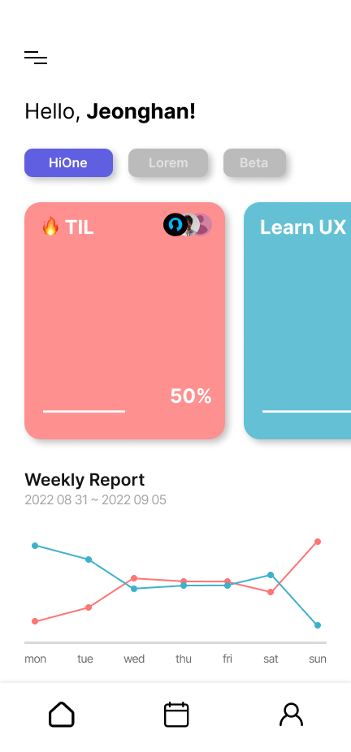
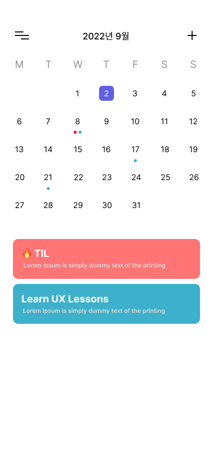
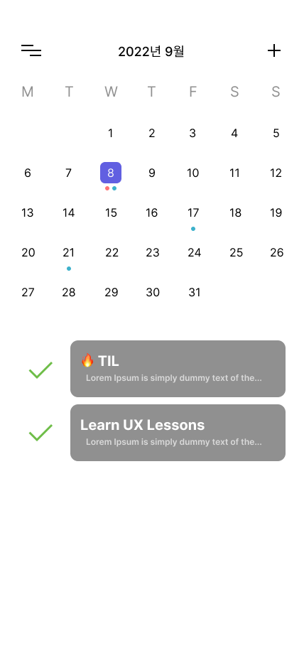

## Main Service

---

팀원들과 함께 의견을 주고 받으며, 일정을 공유해보세요!

<div align="left">
  
  
  
</div>

## ERD

---

<a href="https://github.com/Team-HiOne/TiKA-BE/blob/master/prisma/schema.prisma"></a>

## APIs

---

| Model    | URL                                       | Method | note                                   |
| -------- | ----------------------------------------- | ------ | -------------------------------------- |
| user     | http://localhost/user/                    | Get    | 등록된 모드 유저 검색                  |
|          | http://localhost/user/{ID}                | Get    | 해당 아이디로 등록된 유저 검색         |
|          | http://localhost/user/                    | Post   | 유저 회원가입                          |
|          | http://localhost/user/                    | Put    | 유저 정보 변경                         |
|          | http://localhost/user/{ID}                | Delete | 해당 아이디로 등록된 유저 삭제         |
| team     | http://localhost/team/                    | Get    | 등록된 모든 팀 정보 검색               |
|          | http://localhost/{TeamCode}               | Get    | 해당 코드로 등록된 팀 정보 검색        |
|          | http://localhost/team/master/{ID}         | Get    | 해당 아이디가 팀장으로 등록된 팀 검색  |
|          | http://localhost/team                     | Post   | 팀 생성                                |
|          | http://localhost/team/name/{TeamCode}     | Put    | 해당 팀의 팀명 변경                    |
|          | http://localhost/team/master/{TeamCode}   | Put    | 해당 팀의 팀장 변경                    |
|          | http://localhost/team/{TeamCode}          | Delete | 해당 팀 삭제                           |
| joinTeam | http://localhost/jointeam/                | Get    | 모든 팀가입 정보 검색                  |
|          | http://localhost/jointeam/id/{ID}         | Get    | 해당 아이디로 등록된 팀 가입 정보 검색 |
|          | http://localhost/jointeam/team/{TeamCode} | Get    | 해당 팀의 가입 정보 검색               |
|          | http://localhost/jointeam/                | Post   | 해당 팀 가입                           |
|          | http://localhost/jointeam/                | Delete | 해당 유저의 팀 가입 정보 삭제          |
| todo     | http://localhost/todo                     | Get    | 등록된 모든 할일 정보 검색             |
|          | http://localhost/todo/{TeamCode}          | Get    | 해당 팀의 할일 정보 검색               |
|          | 이하 제작중..                             |

## 폴더 구조

---

```
├── prisma : prisma Model 및 migration 파일
├── readme : 리드미 관련 이미지 파일
├── src
│   ├── jointeam : joinTeam API Service, Controller 파일
│   ├── team : team API Service, Controller 파일
│   ├── todo : todo API Service, Controller 파일
│   ├── user : user API Service, Controller 파일
└── 각종 세팅 파일들과 리드미 파일
```
